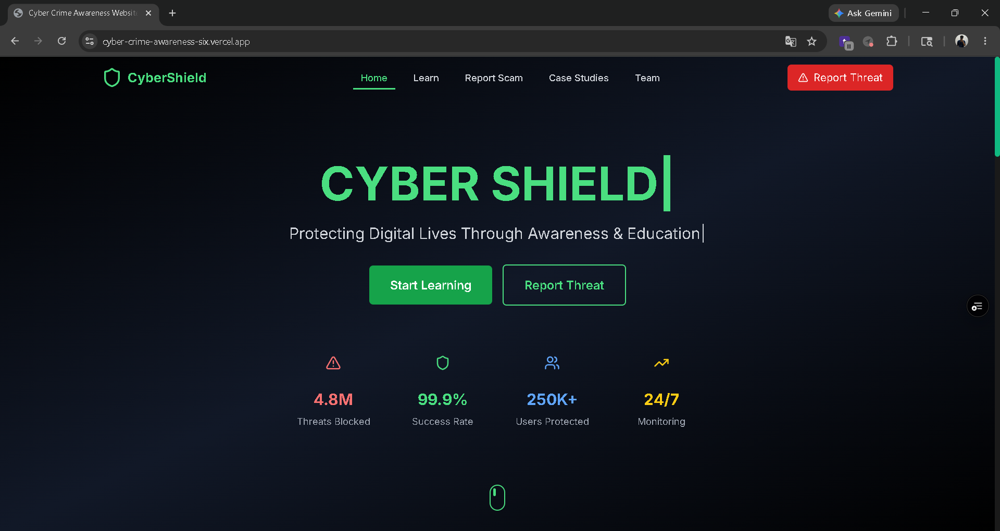
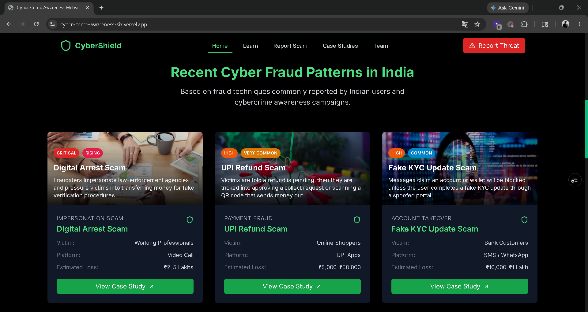
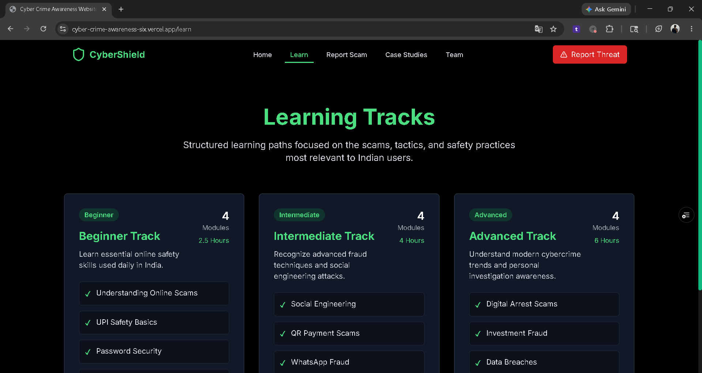
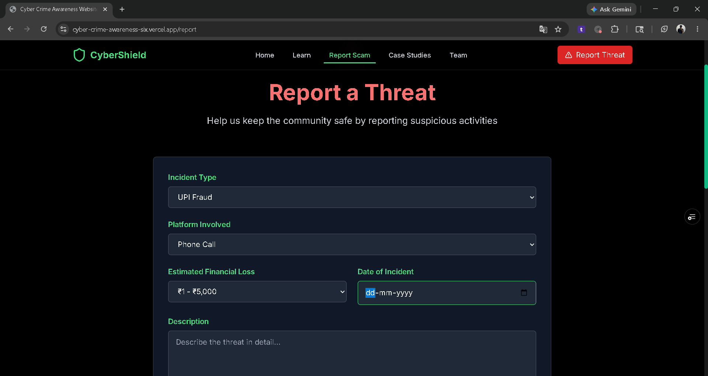
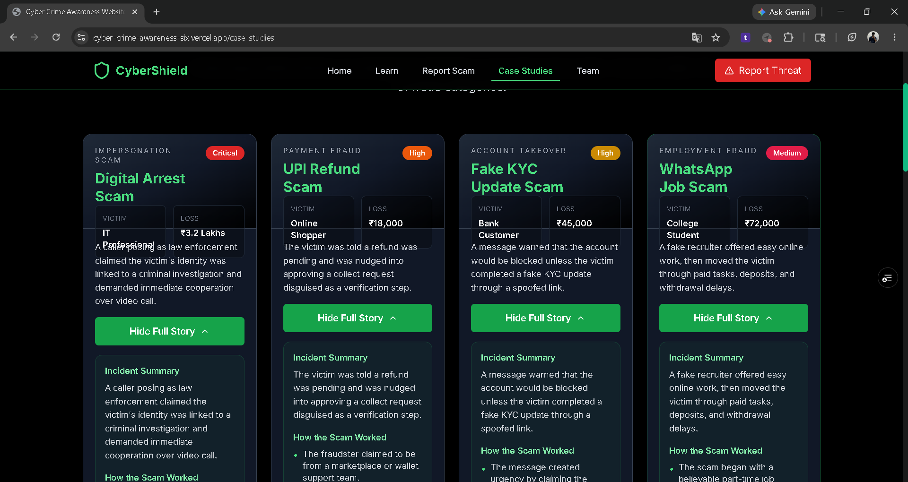
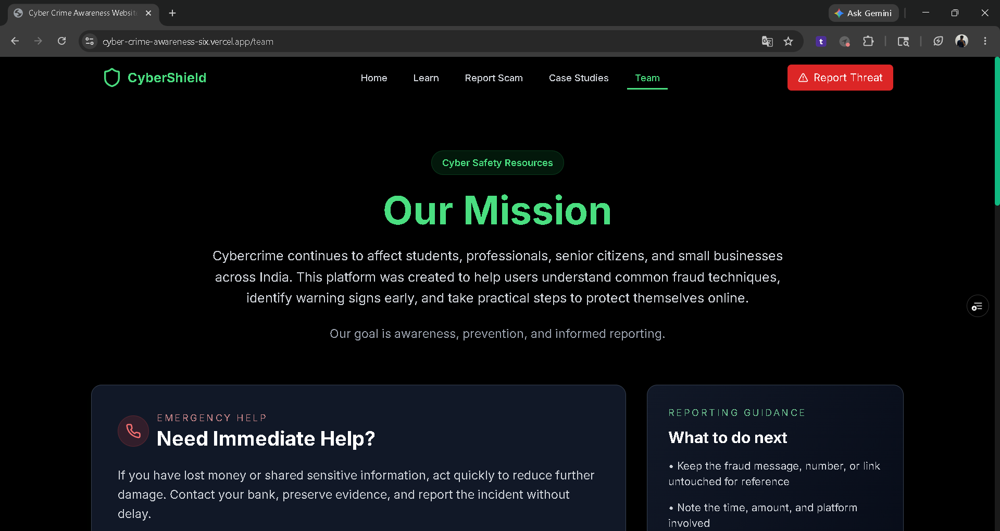

# Cyber Crime Awareness Platform

[](https://cyber-crime-awareness-six.vercel.app/)
[](https://github.com/Anuj18m/cyber-crime-awareness/stargazers)
[](https://cyber-crime-awareness-six.vercel.app/)
[](https://github.com/Anuj18m/cyber-crime-awareness/commits/main)



🛡️ Cybercrime awareness platform focused on fraud prevention, cyber safety education, reporting guidance, and real-world scam awareness.

## Overview

Cyber Crime Awareness Platform is an educational web application designed to help users identify modern cyber frauds, understand scam patterns, explore realistic case studies, and learn practical prevention strategies.

Instead of functioning as a static awareness portal, the platform focuses on actionable cyber safety education through structured learning tracks, realistic incident simulations, reporting workflows, and prevention-focused resources.

## Core Capabilities

- Beginner, Intermediate, and Advanced learning tracks
- India-focused cyber fraud awareness modules
- Guided cyber incident reporting workflow
- Dynamic report reference generation
- Expandable real-world cyber fraud case studies
- Emergency response guidance and helpline information
- Cyber safety checklist and prevention resources
- Responsive user experience across devices

## System Design

```text
React + TypeScript
	↓
React Router
	↓
Learning & Awareness Modules
	↓
Case Studies & Reporting Workflow
```

## Engineering Highlights

- React + Vite architecture
- Component-driven frontend design
- Form validation using React Hook Form and Zod
- Dynamic report ID generation workflow
- Shared TypeScript contracts and data models
- Responsive mobile-first layouts
- Vercel deployment with SPA routing support
- Expandable educational case-study system

## Demo

### Fraud Awareness



### Learning Tracks



### Report Portal



### Case Studies



### Resources



Live Demo: https://cyber-crime-awareness-six.vercel.app/

Repository: https://github.com/Anuj18m/cyber-crime-awareness

## Running Locally

```bash
npm install
npm run dev
```

## Project Structure

```text
cyber-crime-awareness/
├── src/
│   ├── components/
│   ├── pages/
│   ├── data/
│   ├── types/
│   ├── App.tsx
│   └── main.tsx
│
├── screenshots/
│   ├── home.png
│   ├── fraud-patterns.png
│   ├── learning-tracks.png
│   ├── report-portal.png
│   ├── case-studies.png
│   └── resources.png
│
├── public/
├── README.md
├── vercel.json
├── package.json
└── vite.config.ts
```

## Tech Stack

- Frontend: React · TypeScript · Vite · Tailwind CSS · React Router
- Validation: React Hook Form · Zod
- Deployment: Vercel

## Future Scope

- Multi-language awareness modules
- Dedicated mobile experience
- AI-powered cyber safety assistant
- Awareness analytics dashboard
- Interactive scam simulation modules
- Personalized cyber safety learning paths

## Disclaimer

This platform is created for educational and awareness purposes only.

All case studies are illustrative scenarios designed to demonstrate common cyber fraud patterns, warning signs, and prevention techniques. No real individuals are represented.

## Author

Anuj Mhatre

🔗 https://linkedin.com/in/anujmhatre17
